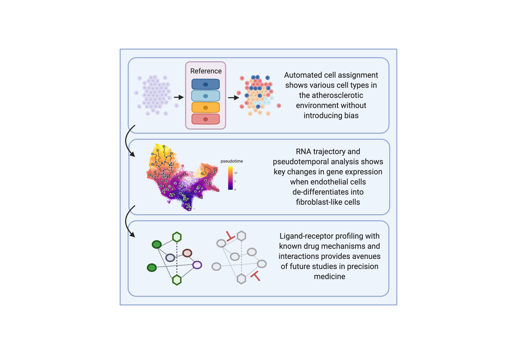

# Drug Discovery scRNA-seq Workflow used in Ma et al. 2020
## Single-cell RNA-seq analysis of human coronary arteries using an enhanced workflow reveals SMC transitions and candidate drug targets

### Comprehensive single-cell RNA seq analysis workflow: automatic cell labeling to drug targeting 
Wei Feng Ma, Chani J. Hodonsky, Adam W. Turner, Doris Wong, Yipei Song, Nelson Barrientos, Clint L. Miller
University of Virginia, Center for Public Health Genomics

## Graphical Abstract

## Overview
This workflow is divided into several parts:

Part1) data import into Seurat, automated cell labeling in 'singleR', Trajectory analysis in 'Monocle3'

Part2) alternative steps to benchmark tools e.g. 'scCatch' (singleR alternative)

Part3) ligand-receptor profiling in 'scTalk', drug target analysis in DGIdb

Part4) 'dynverse' (tool to bench other trajectory inference method other than monocle3)

Part5) using a docker-based tool 'DrugThatGene' to search additional drug databases (e.g. Pharos, OMIM, etc.)

## Data Import
If you are planning to use this pipeline, we assume that the data is coming from cellranger or from GEO as a data matrix. Some data sources come as .h5 (optimized python files) or as a seurat object (.rds) that you can directly import, and you can skip this step. NIH has an excellent guide on data format [here](https://med.virginia.edu/faculty/faculty-listing/wap3g/).

The data used in our publication can be found [here](https://www.ncbi.nlm.nih.gov/geo/download/?acc=GSE131780&format=file). Need to unzip to .txt file!

## Getting Started
Copy the git by cloning or by downloading Step 1 and Step 2 in the scripts. Step 3 is docker based, and the steps are outlined in a text file. Step 4 is optional and did not produce any core results in this publication. 'TIP' files are required for the 'scTALK' package. 

First make sure your R 4.0 or above (recommend running as Rstudio) contains the required packages. e.g. [Seurat](https://satijalab.org/seurat/install.html), [Monocle3](https://cole-trapnell-lab.github.io/monocle3/docs/introduction/), and [scTalk](https://github.com/VCCRI/scTalk). Edit your working directory and load your data accordingly. Monocle3 will pop up to ask if you want to subset any datapoints. We recommend running the script line-by-line to maximize discovery and making sure that the script is individualized for you data!

## Support
Raise an issue in our github and we will get back to you ASAP!
